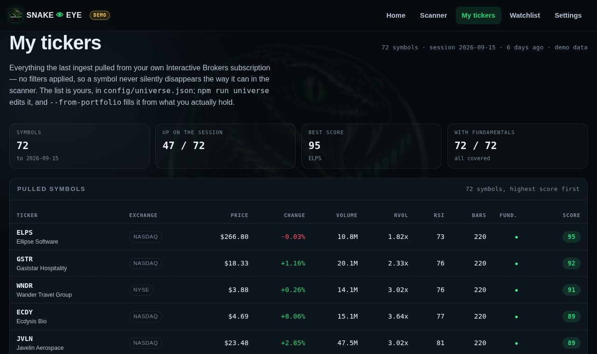

<p align="center">
  
</p>

<h1 align="center">🐍👁️ Snake Eye</h1>

<p align="center"><strong>See the market. Find the target.</strong></p>

A personal stock scanner. It pulls end-of-day bars for my own watch list from my
own Interactive Brokers subscription, fills the fundamentals from SEC filings,
computes the indicators in the browser, and ranks whatever survives the filters
with a single 0–100 **Snake Score**.

It is built for one person on one machine. Plain HTML, CSS and ES modules — no
build step, no dependencies, no backend, no account. The data lives in a file on
disk and never leaves it.

---

## Two data modes, and why the public repository only ever shows one

**Demo** — `data/stocks.json`, committed: 72 invented companies with 220
generated sessions each, from `scripts/generate-stocks.mjs`. The companies are
fictional, but some of the invented four-letter symbols coincide with real
listed tickers (WNDR, MORF, VRDN, IRON and others all trade somewhere) — a
symbol here is **not** the company that really trades under it. Every page
carries a `DEMO` badge while this data is loaded.

**My IBKR data** — `npm run ingest` pulls daily bars through a local Client
Portal Gateway into `data/stocks.local.json`, which the app prefers whenever it
is present.

That file is **git-ignored on purpose**. This repository is public, and market
data from a personal subscription is licensed for personal use, not
redistribution. So the code is public and the data is not: anyone opening the
GitHub Pages site gets the demo universe, and there is no configuration that
changes that. Real data exists only on the machine that pulled it.

---

## Screenshots

### Landing page — the scan, and its results, in one screen


### Scanner — filters on the left, ranked results on the right


### My tickers — everything the last ingest pulled, unfiltered



### Stock page — Snake Score breakdown and the chart stack


---

## Running it

The pages load their data with `fetch`, so they need a web server. Opening
`index.html` from the file system blocks every script on the page — Snake Eye
says so in a banner rather than hanging, but it still will not run.

```bash
npm start        # then http://localhost:8080
```

To refresh the data, the gateway has to be running and logged in first.
**[docs/DAILY.md](docs/DAILY.md)** has the window-by-window routine and a table
of what every error message means.

```bash
npm run gateway                    # running? logged in? uncontested?
npm run ingest                     # daily bars for the whole list
npm run fundamentals -- --contact you@example.com
```

---

## Commands

| | |
|---|---|
| `npm start` | serve the site on `http://localhost:8080` |
| `npm test` | 62 tests — indicator maths, filters, IBKR and SEC mapping |
| `npm run gateway` | diagnose the gateway: not listening, not logged in, or ready |
| `npm run keepalive` | hold the IBKR session open in its own window |
| `npm run ingest` | pull daily bars for the whole list |
| `npm run ticker -- PLUG` | one symbol on demand, with its score breakdown |
| `npm run universe` | show the scan list; `--add` `--remove` `--from-portfolio` edit it |
| `npm run fundamentals` | fill fundamentals from SEC filings |
| `npm run fields` | probe which snapshot field ids this gateway build answers |
| `npm run demo-data` | regenerate the demo universe (same seed → same data) |

None of the tests need a network, a gateway or a key.

---

## Where the fundamentals come from

| Source | Covers | Needs |
|---|---|---|
| **SEC EDGAR** | revenue, growth, EPS, P/E, P/S, ROE, debt/equity, margins, current ratio | nothing — free, no account, no key |
| IBKR snapshot | market cap, P/E, EPS, dividend yield, industry, average volume | a Refinitiv entitlement |
| IBKR Refinitiv | the deeper ratios | the same entitlement |

SEC covers companies that file XBRL with it, which is most US listings and no
foreign private issuers — NIO, GRAB, ABEV, BBD and ITUB come back empty and keep
scoring on three components instead of four.

The IBKR route needs *Reuters/Refinitiv Worldwide Fundamentals* switched on for
the account. Without it the gateway never sends market cap, P/E or EPS at all —
not late, not partially. `npm run ingest` says so in as many words rather than
implying the request was malformed. Details in
**[docs/IBKR.md](docs/IBKR.md)**.

---

## Snake Score

Four sub-scores, each 0–100, weighted into one number:

| Sub-score | Weight | What it reads |
|---|---:|---|
| Technical | 40% | price vs SMA20/50/200, MA stacking, ADX, position in the Bollinger range |
| Momentum | 25% | MACD vs signal, histogram direction, AO level and direction, RSI band |
| Volume | 20% | relative volume, liquidity, volume vs the 50-day average |
| Fundamental | 15% | revenue growth, EPS, EPS growth, P/E, ROE, debt/equity |

Checks are graded rather than pass/fail wherever a metric is continuous — ADX 39
scores higher than ADX 21 instead of both simply clearing a threshold. The stock
page shows the breakdown line by line; so does `npm run ticker`, from the same
code, so the terminal and the page cannot disagree.

When a symbol has no fundamentals, the fundamental sub-score is **dropped** and
the remaining weights are re-normalised to 100 (technical 47%, momentum 29%,
volume 24%). Scoring it as zero instead would dock every such stock the same 15
points and quietly flatten the ranking.

Weights live in `js/score.js`.

---

## How a scan works

```text
data/stocks.local.json     (or data/stocks.json)
      ↓  api.js            load + cache
indicators.js              SMA · EMA · RSI · MACD · AO · ADX · ATR · BB · Stochastic
      ↓
score.js                   technical 40% · momentum 25% · volume 20% · fundamental 15%
      ↓
filters.js                 every active criterion must pass
      ↓
scanner.js                 sort → search → render
```

Every filter is declared once in `js/filters.js`. The form, the URL query
string, the presets and the matching logic all read that one schema, so adding a
filter means adding a field there plus an input whose `name` matches the key.

Scans are shareable: the scanner keeps its filters in the URL
(`pages/scanner.html?priceMin=2&priceMax=30&macdBullish=1`), and
`?preset=breakout` loads a saved strategy directly.

When a strategy matches nothing — which is common over a list of twenty symbols,
since a saved strategy asks six to nine conditions at once — the empty state
names what came closest and what each one is short of, rather than stopping at
"no stocks matched".

---

## Project structure

```text
snake-eye/
├── index.html                  masthead, filters and results in one screen
├── pages/
│   ├── scanner.html            the main workspace
│   ├── universe.html           My tickers: everything the ingest pulled
│   ├── stock.html              one symbol: charts, indicators, fundamentals
│   ├── watchlist.html          saved symbols
│   └── settings.html           data source, storage, roadmap
├── css/                        style · dashboard · scanner · universe · stock · responsive
├── js/
│   ├── app.js                  formatters, DOM helpers, shared chrome, landing page
│   ├── api.js                  data access; prefers the local IBKR file
│   ├── indicators.js           SMA, EMA, RSI, MACD, AO, ADX, ATR, Bollinger, Stochastic
│   ├── filters.js              filter schema, matching, near misses
│   ├── score.js                Snake Score
│   ├── scanner.js              scanner controller
│   ├── universe-page.js        My tickers controller
│   ├── stock.js                stock page controller
│   ├── charts.js               canvas charts
│   ├── watchlist.js            localStorage watchlist
│   ├── watchlist-page.js       watchlist controller
│   └── settings.js             settings controller
├── config/
│   └── universe.json           the scan list — npm run universe edits it
├── data/
│   ├── stocks.json             generated demo universe (committed)
│   ├── stocks.local.json       the real snapshot (git-ignored)
│   └── presets.json            saved strategies
├── scripts/
│   ├── ibkr-ingest.mjs         pulls bars for the whole list
│   ├── ticker.mjs              pulls and scores one symbol
│   ├── universe.mjs            manages the scan list; can seed it from holdings
│   ├── sec-ingest.mjs          fills fundamentals from SEC EDGAR
│   ├── gateway-status.mjs      one-command gateway diagnosis
│   ├── gateway-keepalive.mjs   holds the IBKR session open
│   ├── ibkr-fields.mjs         probes which snapshot field ids a build answers
│   ├── generate-stocks.mjs     demo data generator
│   └── lib/
│       ├── ibkr-client.mjs         everything that talks to the gateway
│       ├── ibkr-normalize.mjs      IBKR payloads → the app's data shape
│       └── sec-fundamentals.mjs    XBRL facts → the fundamentals block
├── tests/                      indicators · filters · ibkr-normalize · sec-fundamentals
└── docs/
    ├── DAILY.md                which windows to open, and what each error means
    ├── IBKR.md                 gateway setup, pacing, field ids, entitlements
    ├── PROJECT.md              architecture and data flow
    ├── API.md                  data contract and the road to a backend
    └── INDICATORS.md           how each indicator is computed
```

---

## Important

Snake Eye is an analysis and filtering tool. **The Snake Score measures how well
a stock matches the selected criteria — it is not a price forecast, not a
guarantee, and not investment advice.** The data is end of day, not live, and
carries whatever delay and gaps the source has.

---

## Про проєкт

**Snake Eye** — персональний сканер акцій NYSE/NASDAQ за ціною, обсягом,
фундаментальними показниками й технічними індикаторами. Зроблений для власного
користування: дані тягнуться з моєї підписки Interactive Brokers на мою ж
машину, фундаментал добирається з подань до SEC, індикатори рахуються в
браузері.

Два режими даних. Демонстраційний (`data/stocks.json`, вигадані тикери) —
саме його бачить кожен, хто відкриє сайт із GitHub. І реальний
(`data/stocks.local.json`), який **не потрапляє в git**: це дані особистої
підписки, їх не можна поширювати. Тому код публічний, а дані — ні.

Як запускати — [docs/DAILY.md](docs/DAILY.md), налаштування гейтвея —
[docs/IBKR.md](docs/IBKR.md).

`Snake Score` — оцінка відповідності заданим критеріям, а не прогноз ціни і не
інвестиційна рекомендація.

---

## License

MIT — see [LICENSE](LICENSE).
