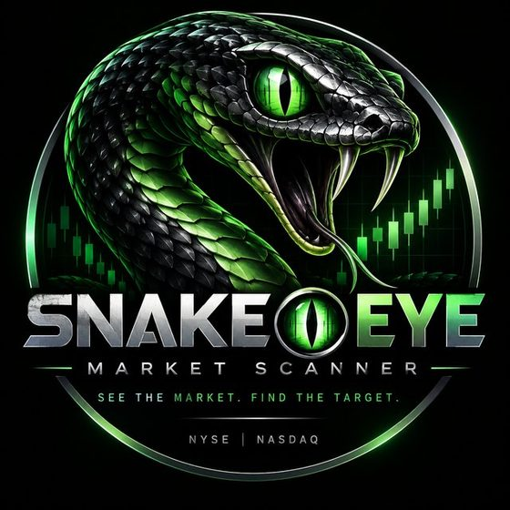
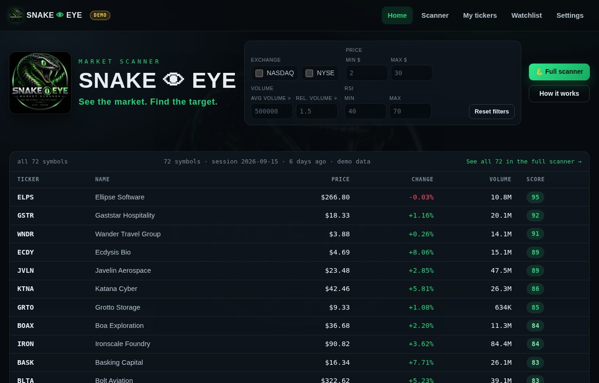
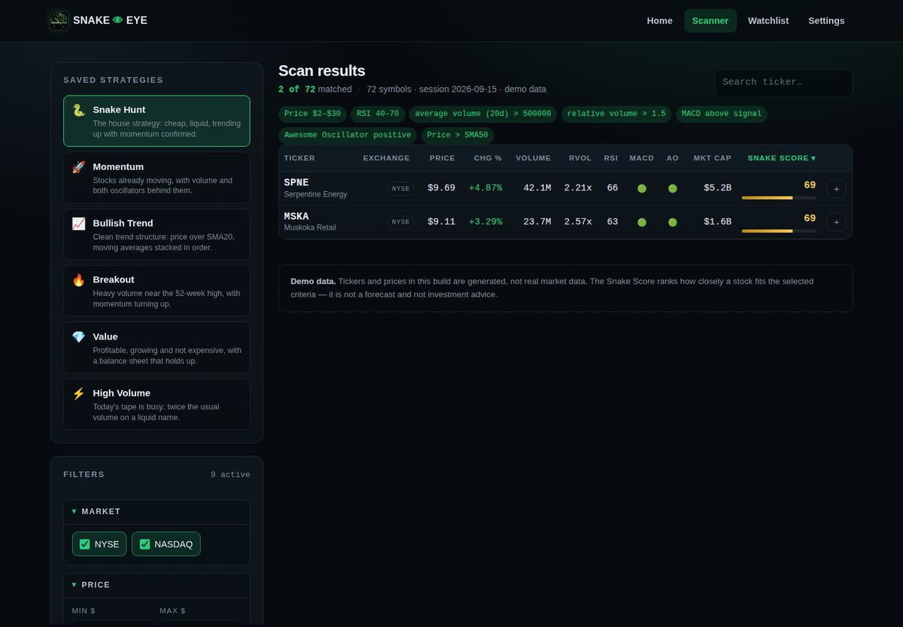
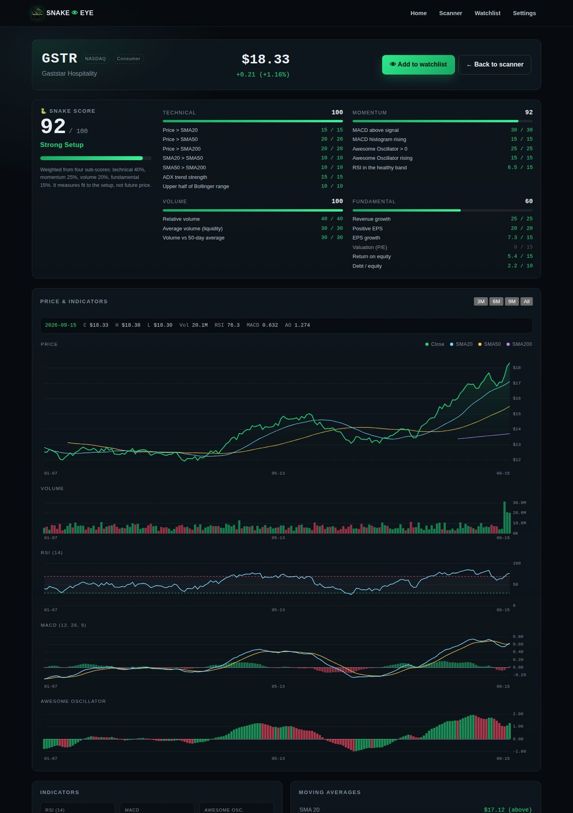

<p align="center">
  
</p>

<h1 align="center">🐍👁️ Snake Eye — Stock Market Scanner</h1>

<p align="center"><strong>See the market. Find the target.</strong></p>

Snake Eye filters a NYSE/NASDAQ-style universe by price, volume, fundamentals and
technical indicators, then ranks whatever survives the filters with a single 0–100
**Snake Score**.

It is a static frontend — plain HTML, CSS and ES modules, no build step and no
dependencies — so it runs anywhere a folder can be served, GitHub Pages included.

---

## Screenshots

### Landing page — quick scan and today's strongest setups



### Scanner — filters on the left, ranked results on the right

Running the **Snake Hunt** preset: price $2–30, average volume over 500K, relative
volume over 1.5, RSI 40–70, MACD bullish, AO positive, price above SMA50.



### Stock page — Snake Score breakdown and the chart stack



---

## Status

This is the **MVP** described in the project plan, plus the Stage 2 charts:

| Feature | State |
|---|---|
| Landing page with quick scan | ✅ |
| Scanner: exchange, price, volume filters | ✅ |
| Scanner: 12 fundamental filters | ✅ |
| Scanner: 13 technical indicators | ✅ |
| Snake Score (4 weighted sub-scores) | ✅ |
| Sortable, searchable results table | ✅ |
| Stock page with price / volume / RSI / MACD / AO charts | ✅ |
| Watchlist in `localStorage` | ✅ |
| Saved strategies (presets) | ✅ |
| Responsive design | ✅ |
| **Real data from Interactive Brokers** | ✅ personal use, end of day |
| Fundamentals from IBKR | ⚠️ needs a Refinitiv entitlement |
| Backend, alerts, backtesting | ⏳ later stages |

Snake Eye runs in either of two modes:

- **Demo** — the committed `data/stocks.json`: 72 invented companies with 220 generated
  sessions each, produced by `scripts/generate-stocks.mjs`. The companies are fictional,
  but be aware that **some of the invented four-letter symbols coincide with real listed
  tickers** (WNDR, MORF, VRDN, XYZ, IRON and others all trade somewhere) — a symbol in the
  demo universe is *not* the company that really trades under it. Every page carries a
  `DEMO` badge while this data is loaded.
- **Your IBKR data** — `npm run ingest` pulls daily bars for your own symbol list
  through a local IB Gateway into `data/stocks.local.json`, which the app prefers when
  it is present. That file is git-ignored: it is your subscription's data, and it is
  for personal use, not redistribution. See **[docs/IBKR.md](docs/IBKR.md)**.

---

## Run it

The app loads `data/stocks.json` with `fetch`, so it needs a web server — opening
`index.html` straight from the file system will not work.

```bash
npm run serve        # then open http://localhost:8080
```

The first run fetches a tiny static server through `npx`. Any other static server
works just as well.

Regenerate the demo universe (deterministic, same seed → same data):

```bash
npm run demo-data
```

Run the tests (no dependencies, no network, no gateway needed):

```bash
npm test          # 23 tests: indicator maths and IBKR normalisation
```

### Real data from Interactive Brokers

```bash
# 1. start the IBKR Client Portal Gateway and log in at https://localhost:5000
# 2. list the symbols you care about in config/universe.json
npm run gateway                 # is it running, logged in, uncontested?
npm run ingest -- --limit 5     # smoke test
npm run ingest                  # the full list
```

The scanner header then reads `Interactive Brokers · end of day` instead of
`demo data`. Setup, pacing limits, the volume-in-lots trap and troubleshooting are all
in [docs/IBKR.md](docs/IBKR.md).

Deploy: push to GitHub and enable Pages on the branch root. There is nothing to build.

---

## Project structure

```text
snake-eye/
├── index.html              landing page + quick scan
├── pages/
│   ├── scanner.html        the main workspace
│   ├── stock.html          single symbol: charts, indicators, fundamentals
│   ├── watchlist.html      saved symbols
│   └── settings.html       data source, storage, roadmap
├── css/
│   ├── style.css           design tokens, chrome, shared components
│   ├── dashboard.css       landing page
│   ├── scanner.css         scanner + results table
│   ├── stock.css           stock page, watchlist cards
│   └── responsive.css      every breakpoint, in one place
├── js/
│   ├── app.js              formatters, DOM helpers, shared chrome, home page
│   ├── api.js              data access + the seam for a real provider
│   ├── indicators.js       SMA, EMA, RSI, MACD, AO, ADX, ATR, Bollinger, Stochastic
│   ├── filters.js          filter schema + matching
│   ├── score.js            Snake Score
│   ├── scanner.js          scanner page controller
│   ├── stock.js            stock page controller
│   ├── charts.js           canvas charts
│   ├── watchlist.js        localStorage watchlist
│   ├── watchlist-page.js   watchlist page controller
│   └── settings.js         settings page controller
├── config/
│   └── universe.json       your IBKR scan list
├── data/
│   ├── stocks.json         generated demo universe (committed)
│   ├── stocks.local.json   your IBKR snapshot (git-ignored, created by the ingest)
│   └── presets.json        saved strategies
├── scripts/
│   ├── generate-stocks.mjs demo data generator
│   ├── ibkr-ingest.mjs     pulls real bars from a local IB Gateway
│   └── lib/
│       └── ibkr-normalize.mjs  IBKR payloads -> the app's data shape
├── tests/
│   ├── indicators.test.mjs     indicator maths, edge cases and invariants
│   └── ibkr-normalize.test.mjs the IBKR mapping, no gateway required
└── docs/
    ├── PROJECT.md          architecture and data flow
    ├── IBKR.md             real data: setup, pacing, entitlements
    ├── API.md              data contract and the road to a backend
    └── INDICATORS.md       how each indicator is computed
```

The plan's file list also mentioned `js/app.js` covering the home page; the two extra
files here (`js/stock.js`, `js/watchlist-page.js`) keep each page's controller next to
the page it drives instead of piling everything into `app.js`.

---

## How a scan works

```text
data/stocks.json
      ↓  api.js       load + cache
indicators.js         SMA · EMA · RSI · MACD · AO · ADX · ATR · BB · Stochastic
      ↓
score.js              technical 40% · momentum 25% · volume 20% · fundamental 15%
      ↓
filters.js            every active criterion must pass
      ↓
scanner.js            sort → search → render
```

Every filter is declared once in `js/filters.js`. The form, the URL query string, the
presets and the matching logic all read that one schema, so adding a filter means
adding a field there plus an input whose `name` matches the key.

Scans are shareable: the scanner keeps its filters in the URL
(`pages/scanner.html?priceMin=2&priceMax=30&macdBullish=1`), and `?preset=breakout`
loads a saved strategy directly.

---

## Snake Score

Four sub-scores, each 0–100, weighted into one number:

| Sub-score | Weight | What it reads |
|---|---:|---|
| Technical | 40% | price vs SMA20/50/200, MA stacking, ADX, position in the Bollinger range |
| Momentum | 25% | MACD vs signal, histogram direction, AO level and direction, RSI band |
| Volume | 20% | relative volume, liquidity, volume vs the 50-day average |
| Fundamental | 15% | revenue growth, EPS, EPS growth, P/E, ROE, debt/equity |

Checks are graded rather than pass/fail wherever a metric is continuous — ADX 39 scores
higher than ADX 21 instead of both simply clearing a threshold. The stock page shows the
full breakdown, line by line. Weights live in `js/score.js`.

When a data source supplies no fundamentals — which is the normal case on IBKR without a
Refinitiv entitlement — the fundamental sub-score is **dropped** and the remaining weights
are re-normalised to 100 (technical 47%, momentum 29%, volume 24%). Scoring it as zero
instead would dock every stock the same 15 points and quietly flatten the ranking.

---

## Important

Snake Eye is an analysis and filtering tool. **The Snake Score measures how well a stock
matches the selected criteria — it is not a price forecast, not a guarantee, and not
investment advice.** Any real deployment also has to account for market data delay, data
quality, exchange licensing rules, and trading fees and risk.

---

## О проекте

**Snake Eye** — веб-приложение для поиска акций NYSE/NASDAQ по цене, объёму, финансовым
показателям и техническим индикаторам. Это MVP из плана проекта: главная страница,
сканер со всеми фильтрами, Snake Score, таблица результатов, страница акции с графиками
и watchlist в `localStorage`.

Два режима данных: демонстрационный (`data/stocks.json`, вымышленные тикеры) и реальный —
`npm run ingest` забирает дневные бары по вашему списку символов через локальный IB
Gateway в `data/stocks.local.json`. Этот файл не попадает в git: это данные вашей
подписки, только для личного использования. Настройка — в [docs/IBKR.md](docs/IBKR.md).

`Snake Score` — внутренняя оценка соответствия заданным критериям, а не прогноз цены и не
инвестиционная рекомендация.

## License

MIT — see [LICENSE](LICENSE).
